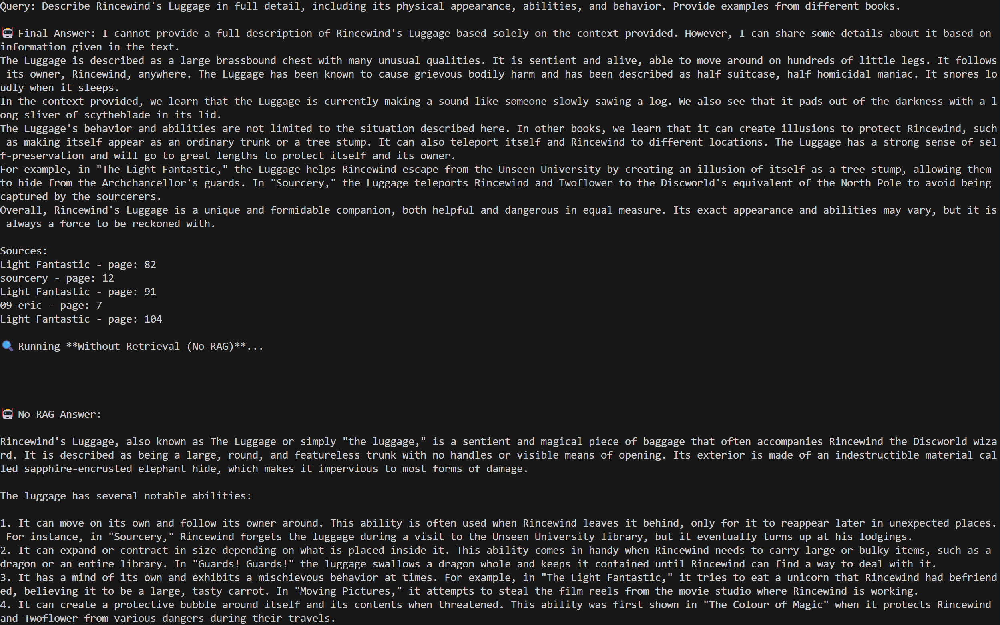

## Project Motivation: Continuing Terry Pratchett’s Legacy Through AI

Terry Pratchett's passing in 2015 marked the loss of one of the greatest literary voices of our time. His works were more than just stories—they were windows into human nature, wrapped in satire, humor, and profound wisdom. He had a unique ability to hold up a mirror to society, showing us our absurdities while reminding us of our potential for kindness, courage, and change.

My project is driven by the belief that stories don’t end with their authors—they continue in the minds of those who love them. With **Retrieval-Augmented Generation (RAG)** and conversational AI, along with application of **LLM fine-tuning**, I aim to build a chatbot that can write and respond in Pratchett’s voice, capturing his style, humor, and philosophy. This isn’t about replacing his genius—because that’s impossible—but rather about exploring what it means to keep his stories alive.

I hope to create a tool that doesn’t just mimic his words but understands the themes that made his work precious to us — the balance of cynicism and optimism, the sharp wit, the deep respect for stories and their power to move. If we could craft new adventures that feel true to his world, where Death still speaks in ALL CAPS, where wizards are gloriously incompetent, and where heroes (reluctant or otherwise) continue stumbling into history, it would be like a love letter to Pratchett's legacy. 

Because, as Pratchett himself wrote:

*“No one is actually dead until the ripples they cause in the world die away.”*

*“And what would humans be without love?" RARE, said Death. (Reaper Man)*

---
*For copyright reasons, the books, text embeddings, and model weights are not pushed to this repo.*
*This repo is an exploratory study, so the studies, techniques discussed here are not immediately the best and final ways to go about things..methods will be refined and more polished as time passes - as I am an advocate for continous improvement ;D *

### The first step - Exploring themes of Discworld through Topic Modeling

**topic_modeling.ipynb**

If you are new to Discworld, topic_modeling.ipynb explores the use of Latent Dirichlet Allocation (LDA) as a tool for topic modeling. Text is extracted from pdf copies of his books and processed with NLP techniques (cleaning, tokenization, lemmatization with POS tagging..etc). 
It attempts to uncover the major themes in Discworld, and it will be interesting to see if we can get an accurate modeling. 
pyLDAvis is a handly interactive tool that is explored in this notebook that visualises the topics that have been identified by the LDA model.

    
    

---
### Anomaly Detection - Which is not like the others? Using an Autoencoder and Visualising Anomalies

**anomaly_detection.ipynb**

**Does the generated text meet Pratchett's original style of wit, irony and humour?**
An excerpt from *Thud!* is extracted below, and we see Pratchett's unique humour and illustrative style of writing. Instead of 'Vimes disliked chess, he never understood it', we have a humourous text below with a jab at monarchy and a philosophical take on how if 'pawns' worked together, they could change the system.

*"Vimes had never got on with any game much more complex than darts. Chess in particular had always annoyed him. It was the dumb way the pawns went off and slaughtered their fellow pawns while the kings lounged about doing nothing that always got to him; if only the pawns united, maybe talked the rooks round, the whole board could’ve been a republic in a dozen moves."*

Autoencoders have been used in anomaly detection particularly in cases where anomalies are rare and difficult to label. We can consider using this as a means to differentiate generated text that is non-Pratchett-like, ensuring that our chatbot only generates Pratchett-like content.

A type of neural network primarily used for unsupervised learning, the autoencoder consists of 2 parts, the encoder and the decoder. The encoder compresses the input data into a lower-dimensional latent representation (bottleneck), and the decoder reconstructs the original input from the latent representation. When the reconstruction error is high, the input is likely an anomaly, because the model detects that it is significantly different from its learnt representations.

In **anomaly_detection.ipynb**, our simple autoencoder is trained on the text embeddings of the pdfs, and passed in test embeddings (non-Pratchett like text) to see if it was able to differentiate them. 

We also visualise the text embeddings (Pratchett's original texts versus flagged anomalies) to see how they are different. Here, we can see that the ones flagged as anomalies are on the outer circumference of the other embeddings.

    
    

We evaluate the model by curating a few test sentences and paragraphs and passed them into the model. From the results, we determined the factors influencing our anomaly detection model - summarised in a table below. 

At this stage, the accuracy of the autoencoder is not the primary objective but rather an exploratory step in understanding how well it distinguishes stylistic anomalies. To ensure that the model is accurate enough, we will need to work with a dataset mixed with a greater number of non-Pratchett-like texts, in order to measure its prediction accuracy. Since human verification will be required, this is left for future work.

---

### Next steps - RAG and using an LLM to summarise responses to queries

**RAG applications** 
typically have 2 main components, **indexing**, and **retrieval and generation**. The diagrams below are created to illustrate the process.
Indexing is a crucial step, as it organizes chunked text into a searchable format, allowing relevant information to be efficiently retrieved when a query is made.

In this application, we leverage CUDA-enabled code to harness the power of the GPU, ensuring efficient and accelerated computations. We will be using open-source llms and embedding models to build the chatbot.

**main.py** - located in src folder

main.py executes the entire RAG flow in a single script, and is designed in a way that enables the user to 'turn off' parts of the code that has completed and no longer needed (for example, after embeddings are generated, there is no need to re-run that step). This can be done by setting the keys in config/default.yaml to true/false based on the current needs. This is particularly useful if the user wants to run the script multiple times, whether debugging or tuning the parameters of the llm.

### Results: LLM outputs compared using RAG versus without using RAG.

After running main.py, you should get an output that is similar to the image that we have appended here for reference.

**With RAG**

The LLM outputs a summary of the retrieved information about the luggage, which we know to be quite accurate, such as:
- the physical appearance of the Luggage (large brassbound chest) :heavy_check_mark:
- it being able to move around on hundreds of little legs. :heavy_check_mark:
- Its homicidal nature and unexplained loyalty to Rincewind is also true. :heavy_check_mark:
- The events described are also accurate :heavy_check_mark:

**Without RAG**

When not using RAG, we observe that while the LLM can provide some correct information (such as the fact that The Luggage is sentient and accompanies Rincewind), much of its response is highly inaccurate. A clear example of this is:
- the description of The Luggage as being "made of sapphire-encrusted elephant hide" :x:, which is completely false.
- another odd claim is that The Luggage tried to eat a unicorn, despite there being no mention of unicorns in The Light Fantastic. :x:
- its ability to create a protective bubble around itself in the face of danger is also inaccurate :x:

These errors highlight the well-documented tendency of LLMs to hallucinate, generating plausible but entirely false information. In contrast, RAG significantly improves accuracy by grounding the model’s responses in real, retrieved sources, ensuring that its output aligns with the actual text rather than fabricated details.

 

---
---
### 

### LLM fine-tuning
*llm fine-tuning is a work-in-progress, we should see updates very soon!*

